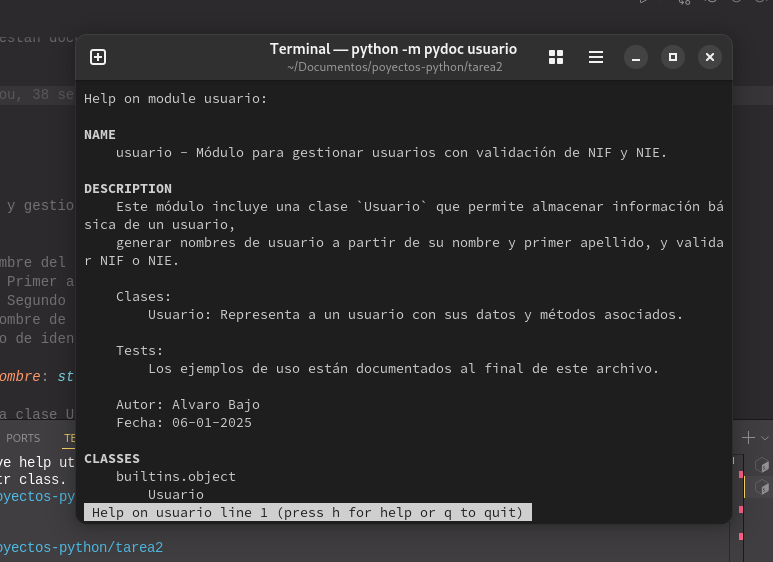

# Proyecto de Gestión de Usuarios

Este proyecto implementa una clase `Usuario` para gestionar los datos de los usuarios, incluyendo validación de NIF/NIE, generación de nombres de usuario y más. El código está documentado y se incluyen pruebas para verificar su funcionamiento.

## Descripción

El archivo `usuario.py` contiene la clase `Usuario`, que permite almacenar información básica de un usuario, como nombre, apellidos y NIF/NIE. Además, incluye funcionalidades para:
- Generar un nombre de usuario a partir de la inicial del nombre y el primer apellido.
- Validar si un NIF o NIE es correcto.
- Asignar un NIF o NIE válido al usuario.

La clase `Usuario` contiene los siguientes métodos:
- **`__init__(self, nombre, apellido1, apellido2)`**: Constructor que inicializa los atributos de la clase.
- **`gen_usuario(self)`**: Genera el nombre de usuario a partir de la inicial del nombre y el primer apellido.
- **`fnif(self, nif)`**: Valida si un NIF es correcto.
- **`fnie(self, nie)`**: Valida si un NIE es correcto.
- **`setnif(self, identificador)`**: Asigna un NIF o NIE al usuario si es válido.

## Tests

El archivo `usuario.py` incluye pruebas para verificar el correcto funcionamiento de la clase `Usuario`. Las pruebas cubren:
- La generación del nombre de usuario.
- La validación de NIF.
- La validación de NIE.
- La asignación de un NIF o NIE válido o inválido.

Las pruebas se encuentran al final del archivo `usuario.py` dentro del bloque `if __name__ == "__main__":`.

## Documentación

La documentación del código se ha generado utilizando la herramienta `pydoc`. La salida está disponible en formato HTML y se puede consultar directamente.

### Cómo procesar la clase y generar la documentación

1. Para generar la documentación en formato HTML desde la terminal, navega al directorio donde se encuentra el archivo `usuario.py`.
2. Ejecuta el siguiente comando:

   ```bash
   pydoc -w models.usuario
   ```

3. Esto generará un archivo `usuario.html` en el directorio actual con la documentación del código.

### Ver la documentación en la terminal

Para ver la documentación directamente en la terminal, utiliza el siguiente comando:

```bash
python -m pydoc models.usuario
```

## Imagen de la salida de la consola

A continuación, se muestra una captura de pantalla de la salida de la consola con la documentación generada.



## Autor

Álvaro Bajo Tabero

## Fecha

06-01-2025
